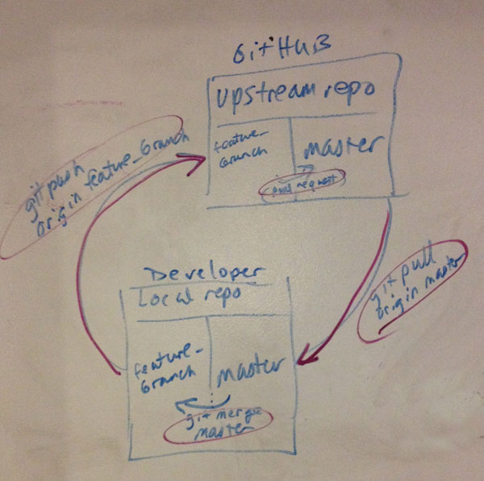

# Team Turing, Project 2: Bob's Bagels

## Client Requirements
- menu must be visible on the site
- Bob’s bio must be somewhere on the site
- users can place orders and are billed appropriately (including delivery charges)
- users can see an order history
- users can view an order in progress and change the order before placing it
- users can customize sandwiches by adding items (increasing the price) or removing items (not affecting the price)
- users can pay by credit card (via the Stripe API)

## GitHub Workflow

